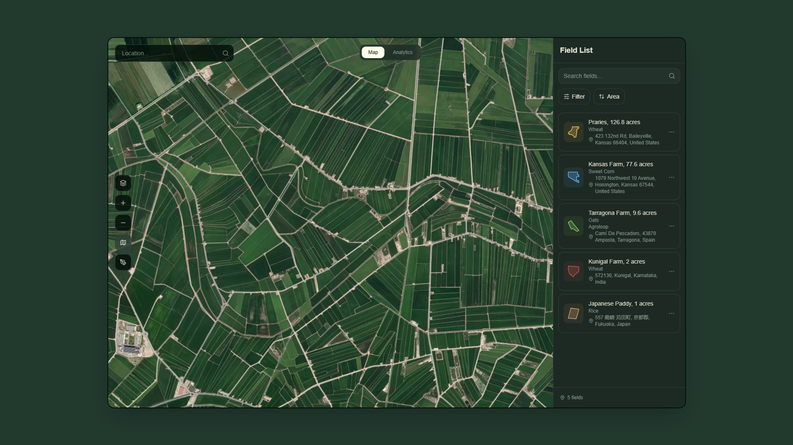

# Virdis


Virdis is a satellite-powered agricultural and land analytics platform that combines Sentinel-2 satellite imagery, Google Earth Engine processing, real-time weather data, soil science databases, and AI-driven crop planning into a single web dashboard.

Users draw polygonal regions on an interactive map and receive vegetation health analysis (NDVI), climate analytics, soil profiling, air quality data, land use classification, land suitability scoring, and AI-generated crop planning recommendations.

## Preview

[](https://virdis.vercel.app)

<br>

> <a href="https://virdis.vercel.app">
>  
> </a>

## What Virdis Does

Virdis enables users to:

- Map and manage regions on an interactive satellite map with polygon drawing tools
- Monitor vegetation health using NDVI analysis from Sentinel-2 10m resolution imagery
- Access detailed soil health profiling from the ISRIC SoilGrids database
- Monitor air quality with PM2.5, PM10, and AQI readings
- Classify land use from ESA WorldCover satellite data via Google Earth Engine
- AI-based crop planning with visual field layouts, intercropping strategies, and crop rotation plans
- Compare two regions side-by-side with synchronized analytics charts
- Export crop plans as PDF documents

## Key Features

### Interactive Satellite Mapping

- Satellite and dark basemap styles powered by Mapbox GL JS
- Polygon drawing with a pen tool for custom region boundaries
- Region editing and deletion with boundary modification
- Fly-to animations when selecting regions from the list
- NDVI overlay from Google Earth Engine tile service
- Location search with Mapbox geocoding and reverse geocoding
- Auto-detection of region type (rural vs urban) using GEE land use data


### NDVI Vegetation Analysis

Sentinel-2 imagery is processed through Google Earth Engine to calculate the Normalized Difference Vegetation Index.
This NDVI data is displayed as a semi-transparent raster layer above the satellite basemap,

NDVI = (NIR - Red) / (NIR + Red)

| NDVI Range | Vegetation Status |
|------------|-------------------|
| Below 0.2 | Critical / bare soil |
| 0.2 to 0.4 | Stressed vegetation |
| 0.4 to 0.6 | Moderate vegetation |
| Above 0.6 | Healthy vegetation |

### Climate Analytics Dashboard

Per-region weather analysis with current conditions, precipitation trends (incl. evapotranspiration), temperature ranges, soil moisture (surface & deep), and selectable date range

Air quality monitoring with AQI , PM2.5 levels, and color-coded indicators.

### Soil Health Profiling

Soil data fetched from the ISRIC SoilGrids REST API at 250m resolution:

- Soil classification (WRB taxonomy) with descriptions and icons
- pH measurement with rating
- Organic carbon content 
- Total nitrogen content
- Cation exchange capacity (CEC)
- Bulk density
- Coarse fragment percentage
- Soil composition (sand, silt, clay percentages) with USDA texture class
- Water retention: field capacity, wilting point, available water capacity
- Donut chart to visualize soil composition
  
### Land Use Classification

ESA WorldCover 10m land cover classification via Google Earth Engine:

- Cropland, tree cover, grassland, shrubland, built-up, water, bare/sparse, wetland, snow/ice, mangroves, moss/lichen
- Interactive donut chart with percentage breakdown
- Used for urban region detection (30%+ built-up area triggers urban mode)
- Water body edge case detection (80%+ water blocks crop planning)

### Land Suitability Scoring

Radar chart of six land suitability metrics :

- Soil quality (from SoilGrids data)
- Water access (rainfall and soil moisture)
- Climate suitability (temperature and precipitation patterns)
- Topography (elevation and slope from SRTM 30m DEM)
- Drainage assessment
- Nutrient level scoring


### AI Crop Planning

Dual-approach crop planning system:

**Local Agronomy Model**

A client-side scoring engine with 50+ crop profiles that runs immediately:

- Detects climate region from location text (tropical, Mediterranean, temperate, arid, continental, highland, coastal, humid, subtropical)
- Scores each crop against field signals: temperature, rainfall, soil pH, NDVI health, water index, humidity, soil quality, climate quality, topography
- Allocates area proportionally to suitability scores (best crop gets 40-55%, not equal splitting)
- Generates intercropping pairs and 3-season rotation plans
- Penalizes crops that do not match the detected climate region

**Planner (Background)**

Calls Google Gemini 2.5 Pro with full field context (NDVI, soil, weather, suitability, land use data). The AI response replaces the local model when available.

**Crop Visualization**

- Satellite minimap showing the field boundary on Mapbox satellite imagery
- Static dot grid fills the entire field polygon with crop markers using point-in-polygon testing
- Variable dot sizes: trees get 16px dots, small grains get 7px
- Color-coded legend with crop filtering (click to show/hide individual crops)

**Plan Outputs**

- Zone allocation pie chart with percentage breakdown
- Per-zone details: area percentage, spacing, water needs, yield estimate, season, reasoning
- Intercropping pair suggestions with spacing guidance
- 3-season crop rotation plan with current season highlighted
- Water saving percentage and revenue boost estimates
- PDF export of the complete crop plan

### Edge Case Detection

The system detects unsuitable regions and blocks crop planning:

| Edge Case | Detection Method | Threshold |
|-----------|-----------------|-----------|
| Water bodies | ESA WorldCover "Water" land use percentage | 80% or more |
| Extreme deserts | Annual rainfall from CHIRPS via GEE | Below 50mm, or keyword match (Sahara, Atacama, etc.) |
| Polar regions | Average latitude of polygon coordinates | Above 66 degrees, or keyword match (Antarctica, etc.) |
| High altitude | Elevation from SRTM via GEE | Above 5000m |
| Urban regions | ESA WorldCover "Built-up" percentage | 30% or more (switches to urban analytics mode) |

### Region Comparison

- Side-by-side comparison of two regions with synchronized charts
- Selectable comparison target from existing regions
- Independent chart rendering per region


## Architecture

```
User / Browser
      │
      ▼
Frontend
React + Mapbox GL JS + Tailwind + shadcn
      │
      ▼
Edge Functions (Supabase - Deno)
      │
 ┌───────────────┬───────────────┬───────────────┬───────────────┬───────────────┬───────────────┐
 ▼               ▼               ▼               ▼               ▼               ▼
Mapbox Token   Field Analysis   Land Analytics  NDVI Tiles      NDVI Series     Soil Data
(Mapbox API)   (GEE + AI)       (GEE)           (GEE)           (GEE)           (SoilGrids)
                   │               │               │               │               │
                   ▼               ▼               ▼               ▼               ▼
             AI Crop Planning   Land Use        Tile Service    Time-Series     Soil Properties
             (Gemini 2.5 Pro)   + Suitability                                   (250m)
                   │
                   ▼
            Crop Recommendations

      │
      ▼
External Data Sources
      │
 ┌───────────────┬───────────────┬───────────────┬───────────────┐
 ▼               ▼               ▼               ▼
Google Earth    Open-Meteo     SoilGrids       Mapbox
Engine          (Weather)      (Soil Data)     (Maps API)
      │
      ▼
Sentinel-2 • ESA WorldCover • SRTM • CHIRPS
```

## Tech Stack

| Layer | Technology | Purpose |
|-------|-----------|---------|
| Frontend | React 18 + TypeScript 5 | UI framework with type safety |
| Build Tool | Vite 5 | Development server and production bundling |
| Styling | Tailwind CSS 3 + shadcn/ui (Radix primitives) | Utility-first CSS with accessible component library |
| Mapping | Mapbox GL JS 3 | Interactive 3D satellite map rendering |
| Charts | Recharts | Data visualization (area, bar, line, pie, radar charts) |
| Routing | React Router 6 | Client-side SPA navigation |
| Server State | TanStack React Query 5 | Async data fetching and caching |
| Backend | Supabase Edge Functions (Deno) | Serverless API endpoints |
| Satellite | Google Earth Engine | Sentinel-2 NDVI, ESA WorldCover, SRTM, CHIRPS |
| AI | Google Gemini 2.5 Pro | Crop planning and field analysis |
| Weather | Open-Meteo | Current forecast, historical archive, air quality |
| Soil | ISRIC SoilGrids | Soil properties (pH, carbon, nitrogen, texture) |
| PDF | jsPDF | Client-side PDF export of crop plans |
| Animations | tailwindcss-animate | UI transition animations |

## Data Sources and APIs

### Satellite and Earth Observation

| Source | Resolution | Data Provided | Usage |
|--------|-----------|---------------|-------|
| Sentinel-2 (via GEE) | 10m multispectral | NIR and Red bands | NDVI vegetation health analysis |
| ESA WorldCover (via GEE) | 10m land cover | 11 land cover classes | Land use classification, urban/water detection |
| SRTM (via GEE) | 30m elevation | Digital elevation model | Elevation, slope, topography scoring |
| CHIRPS (via GEE) | 5km rainfall | Daily rainfall estimates | Annual precipitation for suitability analysis |

### Weather and Climate

| Source | Endpoint | Data Provided | Usage |
|--------|----------|---------------|-------|
| Open-Meteo Forecast API | /v1/forecast | Current temperature, humidity, wind, weather code, feels-like, soil moisture | Real-time conditions and soil moisture display |
| Open-Meteo Archive API | /v1/archive | Historical daily precipitation, temperature range, evapotranspiration, soil moisture | Climate analytics charts with configurable date range |
| Open-Meteo Air Quality API | /v1/air-quality | PM2.5, PM10, European AQI, US AQI | Air quality monitoring cards |

### Soil Science

| Source | Endpoint | Data Provided | Usage |
|--------|----------|---------------|-------|
| ISRIC SoilGrids | REST API at 250m resolution | pH, organic carbon, nitrogen, bulk density, CEC, sand/silt/clay texture, coarse fragments, water retention (field capacity, wilting point, available water) | Soil health profiling, texture pie chart, crop suitability input |

### Mapping and Geocoding

| Source | Data Provided | Usage |
|--------|---------------|-------|
| Mapbox GL JS | Vector and satellite tile rendering | Interactive map with satellite basemap |
| Mapbox Geocoding API | Forward and reverse geocoding | Location search bar, auto-detection of region location |

### AI

| Source | Model | Usage |
|--------|-------|-------|
| Google Gemini 2.5 Pro | Large language model | Crop planning with native plant enforcement, field analysis, region-specific recommendations |

## Edge Functions

| Function | Method | Input | Output | External Calls |
|----------|--------|-------|--------|----------------|
| get-mapbox-token | POST | (none) | { token } | Reads MAPBOX_TOKEN secret |
| analyze-field | POST | polygon coordinates, field metadata, weather, soil data | NDVI stats + AI analysis text | GEE (Sentinel-2 NDVI), Gemini 2.5 Pro |
| gee-analytics | POST | polygon, analyses array | land_use, vegetation, suitability objects | Google Earth Engine (WorldCover, Sentinel-2, SRTM, CHIRPS) |
| gee-ndvi-tiles | POST | polygon, date | Tile URL template | Google Earth Engine |
| ndvi-timeseries | POST | polygon | 90-day NDVI array, growth stage, growth rate, canopy cover, biomass | Google Earth Engine (Sentinel-2) |
| soil-data | POST | lat, lon | classification, metrics, texture, water_retention | ISRIC SoilGrids REST API |
| crop-planning | POST | field name, crop, area, location, coordinates, NDVI/soil/weather/suitability data | zones, intercropping, rotation_plan, summary, tips, scores | Gemini 2.5 Pro |
| keepalive | GET | (none) | { status: "ok" } | (none) |

## 📁 Project Structure

```
src/
├── components/
│   ├── MapView.tsx              # Main map with drawing, NDVI overlay, field rendering
│   ├── MapToolbar.tsx           # Left toolbar (zoom, draw, layers, NDVI, compass)
│   ├── SidePanel.tsx            # Right sidebar with field list & detail view
│   ├── FieldDetailView.tsx      # Per-field detail: weather, NDVI, soil, AI analysis
│   ├── FieldCard.tsx            # Compact field card for lists
│   ├── FieldEditDialog.tsx      # Edit field name, crop, color, group
│   ├── FieldComparisonColumn.tsx# Side-by-side field comparison charts
│   ├── WeatherView.tsx          # Full analytics dashboard
│   ├── CropPlanningSection.tsx  # AI crop planning with map visualization
│   ├── NewFieldDialog.tsx       # Create new field from drawn polygon
│   ├── SearchBar.tsx            # Map search with geocoding
│   ├── LocationAutocomplete.tsx # Location input with Mapbox suggestions
│   ├── NdviLegend.tsx           # NDVI color scale legend
│   ├── NdviScrubber.tsx         # NDVI date navigation
│   ├── MobileBottomNav.tsx      # Mobile tab bar
│   ├── MobileFieldSheet.tsx     # Mobile field list overlay
│   ├── MobileDrawPrompt.tsx     # Mobile draw mode controls
│   └── ui/                     # shadcn/ui components
├── data/
│   ├── fields.ts               # Field type definition & helpers
│   └── crops.ts                # Crop options for field creation
├── hooks/
│   ├── use-mobile.tsx           # Responsive breakpoint hook (768px)
│   ├── use-swipe.ts             # Touch swipe gesture detection
│   └── use-toast.ts             # Toast notification hook
├── pages/
│   ├── Index.tsx                # Main page with desktop/mobile layouts
│   └── NotFound.tsx             # 404 page
└── integrations/
    └── supabase/
        └── client.ts            # Supabase client configuration

supabase/functions/
├── analyze-field/index.ts       # AI field analysis
├── crop-planning/index.ts       # AI crop planning (Gemini 2.5 Pro)
├── gee-analytics/index.ts       # Google Earth Engine analytics
├── gee-ndvi-tiles/index.ts      # GEE NDVI tile generation
├── get-mapbox-token/index.ts    # Mapbox token provider
├── keepalive/index.ts           # Health check
├── ndvi-timeseries/index.ts     # NDVI time-series data
└── soil-data/index.ts           # SoilGrids API integration
```

## Configuration

| Secret | Purpose |
|--------|---------|
| MAPBOX_TOKEN | Mapbox GL JS map rendering, geocoding, satellite tiles |
| GEE_SERVICE_ACCOUNT_JSON | Google Earth Engine service account credentials (JSON key) |
| GEE_PROJECT_ID | Google Cloud project ID with Earth Engine API enabled |

## Installation

```bash
git clone https://github.com/your-org/virdis
cd virdis
npm install
npm run dev
```

## Environment Variables

```env
MAPBOX_TOKEN=
GEE_SERVICE_ACCOUNT_JSON=
GEE_PROJECT_ID=
```

Open-Meteo and ISRIC SoilGrids are free public APIs that do not require API keys.

## License

MIT License
